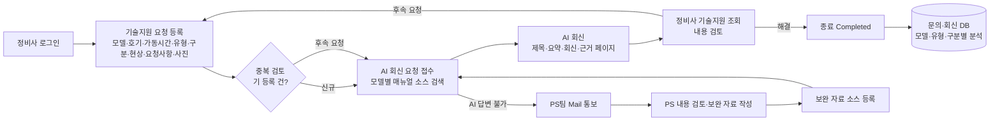

# 지게차 AI 기술지원(AI Field 기술지원) 플랫폼 — 프로젝트 기획서

| 항목 | 내용 |
|---|---|
| 리포 | data09-01 |
| 제출자 | 김봉수 |
| 직무·소속 | 지게차 제조사의 현장 기술지원(PS, Product Support) 관련 업무 — 제출 문서의 "우리 회사는 지게차 제조업이고, 우리는 일선 현장에서 정비사가 … 문의하는 기술적 지원 요청 사항에 대응" 표현 기준. 화면 설계서 푸터에 HD Hyundai XiteSolution 표기가 있음 |
| 과정 | 현장 데이터 수집·디지털화 전문가과정 1차수 |
| 작성일 | 2026-09-28 |
| 문서 상태 | 초안 v0.1 — 수강생 제출 자료 기반 |

> 제출물은 같은 과제의 두 버전입니다(2026-09-08 초안 2건, 2026-09-28 보완 4건). 하나의 과제로 통합해 정리했으며, 필드명·화면 구성은 최신본(09-28 DB.xlsx, 화면구성.xlsx, Flowchart.xlsx)을 기준으로 삼았습니다.

## 1. 추진 배경과 현안

- 전 세계 일선 현장의 정비사가 지게차 하자를 수리하기 전에 본사에 기술 문의를 보내며, 이에 대응하는 데 많은 인원이 필요합니다.
- 현장 기술 문의의 대부분은 정비 매뉴얼에서 답을 찾을 수 있지만, 현장 작업 환경상 정비사가 매뉴얼(종이·PDF)을 쉽게 확인하기 어렵습니다.
- 국가·작업자마다 부품 용어와 하자 현상을 다르게 표현해, 본사 기술지원팀과의 소통이 지연됩니다.
- 수리 완료 뒤의 조치 결과와 현장 사진·영상이 기록되지 않고 흩어져, 정비 매뉴얼·교육교재·품질 개선에 되먹임되지 못합니다.
- 기술 보안상 현장에 제공하는 정보는 해당 문의에 한한 단편적 정보여야 하며, 매뉴얼 전체가 대량으로 배포되는 것은 제한해야 합니다.

## 2. 목표

**최종 목표**

1. 현장 문의를 일정한 형식으로 접수하고, 정비 매뉴얼을 근거로 AI가 1차 답변을 자동 제공합니다.
2. AI로 해결되지 않는 건은 PS 담당자에게 넘기고(메일 통보), PS 담당자의 보완 자료는 다시 AI 소스(NotebookLM 등)에 등록해 답변 품질을 높입니다.
3. 문의·회신·후속 요청·조치 결과를 하나의 기준번호(ref_no)로 묶어 DB화하고, 정비 매뉴얼 반영·기술회보 발행·교육교재 제작·품질 개선에 활용합니다.
4. 제출 PRD(Gemini 작성본)에 적힌 목표치: PS 담당자 리소스 30% 이상 절감, 현장 정비 데이터 100% 디지털화, AI 답변 응답 3초 이내. 이 수치는 생성형 AI가 작성한 문서에 들어 있던 값이므로 수강생 확인이 필요합니다(10장).

**1차 개발 목표**

- 수강생이 설계한 화면(기술지원 1·2·3, 조회, 상세조회, 소스 등록, 접속 Log)과 DB 필드 정의를 그대로 따르는 **브라우저용 기술지원 접수·조회 웹 도구**를 만듭니다.
- 모델별 매뉴얼 소스(NotebookLM 노트북 또는 Dify 지식베이스)와 연결해, 접수 내용에서 AI가 제목(r_title)·요약(req_summary)·회신(reply_content)·근거(ref_info)를 생성하는 흐름을 시연 가능한 수준으로 구현합니다.

## 3. 보유 데이터

| 데이터 | 형태 | 규모·주기 | 비고(민감도 등) |
|---|---|---|---|
| 정비 매뉴얼(모델별) | PDF(추정) | 규모 미제출 — 소스등록 시트에 model ↔ notebook_name 대응표 틀만 있음 | 사내 기술 자료, 보안 등급 높음. 전체 열람·다운로드 제한 요구 |
| 기술지원 등록(Main Data) | 표 — ref_no, status, reg_date, reg_id, model, serial_no, o_hour, type_cd, system_cat | 운영 시 발생 건마다 1행 | serial_no(호기)·가동시간 포함 |
| 문의 | 표 — ref_no, s_turn, reg_date, reg_id, phenomenon, requirement, s_image | 동일 건 재접수 시 s_turn 증가 | s_image는 파일명을 'ref_no_일련번호'로 저장 |
| 회신 | 표 — ref_no, r_turn, r_reply_date, r_title, req_summary, reply_content, ref_info | 회신마다 1행, r_turn 증가 | r_title·req_summary·reply_content는 AI 생성 |
| Reference Data(09-08 초안) | 표 — primary_id, ref_no, seq, ref_info | 근거가 여러 개면 행을 나눔 | 근거 매뉴얼명·페이지 |
| 사용자 | 표 — reg_id, req_name, e_mail, phone, password, country_cd, dealer, join_date, user_type(USER/ADMIN, 기본 USER), territory_cd | 회원 수 미제출 | 개인정보(이메일·전화). 비밀번호는 평문 저장 금지 필요 |
| 접속 Log | 표 — reg_id, login_date, logout_date (+화면에 login 유지 시간) | 로그인마다 | 보안 감사용 |
| 코드값 | type_cd 3종: Troubleshooting(고장진단)·Maintenance(유지보수)·Specification(제원) / system_cat 8종: Transmission·Engine·Electric·Hydraulic·Drive Axle·Steering Axle·Cabin·HVAC / status 3종: Submitted(접수, 빨강)·Answered(회신, 파랑)·Completed(종료, 검정) / territory_cd: 경기·경남·전라·충청·강원·Direct Sales·Europe·North America·South America·Middle East·Africa·Asia·Oceania | 고정 코드 | — |
| 예시 문의 1건 | 화면 설계 예시 | 모델 30BRP-X, 호기 UNFCFB18CF0000452, 가동시간 1234.5, 현상 "클러스터에 에러코드 219, Stepper mot Mism 이라고 뜨며 스티어링 휠이 잠긴 상태임." | 실제 문의·회신 데이터셋은 미제출 |

## 4. 해결 방안 개요

제출 Flowchart(정비사 · AI · PS팀 3개 레인)를 정리하면 다음과 같습니다.

- **수집**: 정비사가 정해진 양식(드롭다운 중심)으로 문의를 등록하고 사진·영상을 첨부합니다. 모델은 소스등록에 있는 모델만 입력 가능하며, 없으면 팝업으로 안내합니다.
- **정리**: 기준번호(yyyymmddnnnn 형식)로 문의·회신·첨부를 묶고, 상태를 색으로 구분합니다.
- **분석·AI**: 모델별 매뉴얼 소스에서 AI가 답변과 근거(매뉴얼명·페이지)를 생성합니다. 답할 수 없으면 관리자에게 메일로 넘깁니다.
- **산출물**: 정비사용 회신 화면, 관리자용 조회·통계, 매뉴얼·교육교재 개선용 누적 DB.

## 5. 주요 기능

| 기능 | 설명 | 우선순위 |
|---|---|---|
| 로그인·언어 선택 | ID/비밀번호 로그인, 한글/영어 전환. 권한 USER/ADMIN | MVP |
| 기술지원 등록(기술지원1) | 모델·호기·가동시간·유형·구분·현상·요청사항 입력, 사진/영상 첨부, 제출 시 ref_no 자동 부여, 상태 Submitted | MVP |
| 모델 입력 검증 | 소스등록에 없는 모델이면 팝업 안내 | MVP |
| 후속 요청(기술지원2·3) | 최근 1달간 본인 등록 건 목록 팝업 → 선택 시 기존 내용을 불러와 수정·재제출, s_turn 증가 | MVP |
| AI 1차 회신 | 모델별 매뉴얼 소스를 근거로 r_title·req_summary·reply_content·ref_info 생성, 상태 Answered | MVP(시연 수준) |
| 근거 페이지 보기 | ref_info 클릭 시 해당 매뉴얼 페이지를 PDF 뷰어로 표시, 이전/다음 페이지 이동 | MVP |
| 기술지원 조회(User) | 등록일 기간·모델로 검색, 목록 더블클릭 시 상세조회(요청 사항과 AI 답변 정리, 추가 요청 버튼) | MVP |
| 기술지원 조회(Admin) | 등록일 기간·모델·딜러·분류·고장 유형 검색, 접수 횟수·딜러·회신 내용 열 추가 | MVP |
| AI 답변 불가 시 관리자 메일 | AI가 판단해 답할 수 없는 건을 PS 담당자에게 메일 통보 | MVP |
| 소스 등록(Admin) | model·notebook_name 입력 + 매뉴얼/보완 자료 파일 업로드. 상세조회에서 넘어오면 기준 정보 자동 입력 | MVP |
| 접속 Log(Admin) | 로그인 일자 기간·사용자·딜러로 검색, 로그인 유지 시간 표시 | 확장 |
| 조치 결과 등록 | 수리 완료 후 최종 조치 내용·완료 사진 등록(PRD에서는 미등록 시 신규 문의 제한 제안) | 확장 |
| 현장 용어 → 표준 용어 사전 | 국가·현장 비표준어를 본사 표준 부품명·증상으로 매칭, 관리자 사전 관리 | 확장 |
| 통계 대시보드 | 모델·호기·가동시간·구분별 다빈도 문의, AI 1차 해결률 | 확장 |
| 보안 강화 | 사번·시간 워터마크, 매뉴얼 전체 다운로드 차단(발췌 페이지만 표시). 모바일 캡처 방지는 네이티브 앱 영역 | 확장 |
| 음성 입력(STT)·다국어 번역 | 현상 입력 음성 지원, 다국어 문의 번역 | 확장 |

## 6. 기대 산출물

- 기술지원 접수·조회 웹 도구(정비사 화면 + 관리자 화면) 프로토타입
- 수강생 DB 필드 정의를 반영한 데이터 스키마와 샘플 데이터(CSV/JSON)
- 모델별 매뉴얼 RAG 지식베이스(Dify 또는 NotebookLM) 1개 이상과 답변 프롬프트
- AI 답변 불가 건 메일 통보 자동화 시나리오(Make)
- 누적 문의·회신 DB 내보내기(엑셀/CSV) — 매뉴얼 개선·교육교재 기초 자료

## 7. 기술 구성

| 영역 | 과정 도구 | 개발 구성 |
|---|---|---|
| 현장 문의 구조화 | DAY1 암묵지 자산화 | 입력 양식·코드값(type_cd·system_cat·status) 정의 |
| 매뉴얼 RAG 답변 | DAY4 Dify 클라우드, NotebookLM | 모델별 지식베이스. 웹 도구는 Dify API(또는 수동 연결)로 질의 (가정) |
| 사진·도면·매뉴얼 PDF 정보화 | DAY3 멀티모달(OCR·도면) | 스캔 매뉴얼 텍스트화, 근거 페이지 추출 |
| 메일 통보·시트 적재 | DAY5 Make(Sheets·Gmail·OpenAI) | 접수 → Google Sheets 기록, AI 답변 불가 시 Gmail 발송 |
| 문의 DB 분석 | DAY2 코랩(Python) | 모델·구분·가동시간별 집계, 다빈도 현상 분석 |
| 웹 도구 | — | 설치 없이 브라우저에서 도는 정적 웹 앱(HTML/JS). 1단계는 브라우저 저장소 + CSV 내보내기, 2단계부터 서버 저장소(Google Sheets 또는 DB) 연결 (가정) |

- 제출 PRD는 모바일 네이티브 앱(캡처 차단, 1인 1기기 인증, Push 알림)을 전제로 하지만, 1차 개발은 모바일 브라우저에서 쓰는 반응형 웹으로 시작하는 것을 제안합니다. 네이티브 전용 기능은 3단계로 미룹니다.
- UI 가이드(PRD): 기본 글자 16pt 이상, 주요 버튼 화면 하단 크게 배치, 채팅 버블형 대화 UI, 50~60대 작업자 친화.

## 8. 개발 단계

**1단계 — 지금 바로 개발 가능한 부분**

제출된 DB 필드 정의·코드값·화면 설계(10개 시트)·예시 문의 1건만으로 만들 수 있는 범위입니다.

- 화면구성.xlsx의 화면을 그대로 옮긴 정적 웹 앱: 접속화면(언어·로그인), 기술지원1(신규 등록), 기술지원2·3(후속 요청), 조회_User·상세조회_User, 조회_Admin·상세조회_Admin, 소스등록, 접속Log.
- DB.xlsx 필드명(ref_no, s_turn, r_turn, o_hour 등)을 그대로 쓰는 데이터 구조, ref_no 자동 채번(yyyymmddnnnn), 상태 색 구분, 소스등록 모델 검증 팝업, 1달간 등록 건 팝업.
- 브라우저 저장 + CSV/엑셀 내보내기(서버 없음), 예시 데이터(30BRP-X, 에러코드 219)로 흐름 시연.
- AI 회신 칸: 접수 내용으로 제목·요약·회신 초안을 만들 프롬프트를 자동 생성해 주고, NotebookLM/Dify 답변을 붙여 넣어 저장하는 반자동 방식.

**2단계**

- 실제 매뉴얼 PDF 1개 모델로 Dify 지식베이스 구성, 웹 도구에서 API로 자동 회신·근거 페이지(ref_info) 생성.
- ref_info 클릭 시 해당 페이지만 PDF 뷰어로 표시(이전/다음 이동), 전체 다운로드 차단.
- Make로 Google Sheets 적재 + AI 답변 불가 건 PS 메일 통보, PS 보완 자료 소스 등록 흐름.
- 로그인(사용자·권한·딜러·territory), 접속 Log 기록.

**3단계**

- 조치 결과 등록(Closed-Loop), 현장 용어 사전, 다국어·STT.
- 통계 대시보드(모델·가동시간·구분별 다빈도, AI 1차 해결률).
- 워터마크·캡처 방지·1인 1기기 인증 등 보안 강화(네이티브 앱 여부 판단), 가동시간 기반 예방정비 알림.

## 9. 기대 효과

- 매뉴얼로 답할 수 있는 단순·반복 문의를 AI가 먼저 처리해 PS 담당자가 어려운 건에 집중할 수 있습니다(제출 PRD 목표: PS 담당자 리소스 30% 이상 절감 — 확인 필요).
- 현장 정비사가 기다리지 않고 답을 받아 장비 다운타임과 수리 시간(MTTR)을 줄일 수 있습니다.
- 문의·회신·첨부가 기준번호로 묶여 쌓이므로, 모델·구분별 다빈도 하자를 파악해 정비 매뉴얼 개정·기술회보·교육교재에 반영할 수 있습니다.
- 매뉴얼 전체가 아닌 관련 페이지만 보여 주므로 기술 자료 유출 위험을 줄입니다.
- PS 담당자의 보완 답변이 소스로 다시 등록되어 AI 답변 품질이 계속 좋아지는 구조가 됩니다.

## 10. 확인 필요 사항

1. **매뉴얼 소스**: 1차 시범 대상 모델(예: 30BRP-X)과 해당 정비 매뉴얼 PDF를 제공받을 수 있는지, 외부 클라우드(Dify·NotebookLM)에 올려도 되는 보안 등급인지.
2. **실제 문의 샘플**: 과거 기술지원 문의·회신 이력(엑셀·메일 등)을 익명화해 수십 건 받을 수 있는지. 현재는 예시 1건뿐입니다.
3. **목표 수치 출처**: PRD의 "30% 이상 절감", "100% 디지털화", "3초 이내"는 생성형 AI 문서에 들어간 값입니다. 실제 목표로 쓸지, 현재 문의 건수·PS 인원 등 기준값이 있는지.
4. **사용자 범위**: 1차 사용자가 국내 딜러(경기·경남 등)인지 해외 법인까지인지, 언어는 한글/영어 2종으로 충분한지.
5. **필드 확정**: 09-08 초안(primary_id·Image O/X·Reference Data 시트)과 09-28 최신본(serial_no·o_hour 추가, 문의/회신 분리) 중 최신본 기준으로 가도 되는지. type_cd 오타 "Specificatio" → "Specification"으로 통일해도 되는지.
6. **조치 결과**: 수강생 원 요구(01 문서 프롬프트)에는 수리 완료 후 결과 등록이 있으나 최신 DB에는 조치 결과 필드가 없습니다. 추가할 필드(조치 내용, 완료 사진, 완료일 등)를 확정해야 합니다.
7. **첨부 제한**: PRD의 "사진 최대 5장/영상 1분" 제한을 그대로 적용할지.
8. **로그인 방식**: 사번 기반인지, 딜러별 발급 ID인지. 기존 사내 계정 연동이 필요한지.
9. **PS 메일 수신자**: 통보 대상 메일 주소·담당자 배정 규칙(모델별·지역별 등).
10. **Flowchart.xlsx**: 도형 텍스트만 추출해 흐름을 재구성했습니다. 화살표 연결 순서가 4장 그림과 맞는지 확인이 필요합니다.
11. 화면구성.xlsx 푸터의 회사 주소·대표전화·사업자번호는 설계 시안용으로 넣은 것으로 보이며, 실제 도구에 표기할지 확인이 필요합니다.

(첨부 파일 6건은 모두 읽었으며, 읽지 못한 파일은 없습니다.)

## 부록. 제출 원문 요약

| 게시물 | 일시 | 제목 | 첨부 파일 | 내용 |
|---|---|---|---|---|
| 1 | 2026-09-08 | AI Field 지술지원 - 기획안(초안) | `att/01_GEMINI____.docx` | 수강생이 Gemini에 입력한 요구사항 프롬프트(배경·수집 데이터·대상·필수 기능·보안 고려) + Gemini 생성 기획안·PRD |
| 2 | 2026-09-08 | AI Field 기술지원 - DB (초안) | `att/02_DB.xlsx` | Data Structure·사용자 기준정보·Manual 기준정보·Log Data·Reference Data·필드 정의 |
| 3 | 2026-09-28 | 기획안 | `att/03_GEMINI____.docx` | Gemini 생성 기획안·PRD(요구사항 프롬프트 부분 제외, 본문은 1과 동일) |
| 4 | 2026-09-28 | DB | `att/04_DB.xlsx` | 등록·문의·회신·사용자·소스등록·Log Data·필드 정의·화면 설계·기능 시트(최신본) |
| 5 | 2026-09-28 | Flowchart | `att/05_flow_Chart.xlsx` | 정비사·AI·PS팀 3개 레인 흐름도(도형 텍스트 추출) |
| 6 | 2026-09-28 | 화면구성 | `att/06_____.xlsx` | 접속화면·기술지원1~3·조회/상세조회(User·Admin)·소스등록·접속Log 10개 화면 설계 |
