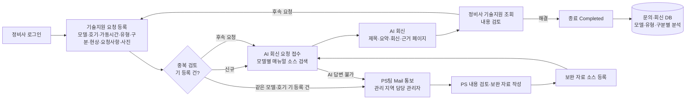

# 지게차 AI 기술지원(AI Field 기술지원) 플랫폼 — 프로젝트 기획서

| 항목 | 내용 |
|---|---|
| 리포 | data09-01 |
| 제출자 | 김봉수 |
| 직무·소속 | 지게차 제조사의 현장 기술지원(PS, Product Support) 관련 업무 — 제출 문서의 "우리 회사는 지게차 제조업이고, 우리는 일선 현장에서 정비사가 … 문의하는 기술적 지원 요청 사항에 대응" 표현 기준. 화면 설계서 푸터에 HD Hyundai XiteSolution 표기가 있음 |
| 과정 | 현장 데이터 수집·디지털화 전문가과정 1차수 |
| 작성일 | 2026-09-28 (v0.3·v0.4·v0.5 개정 2026-09-29) |
| 문서 상태 | 초안 v0.5 — 2026-09-29 저녁 수강생 추가 요청(매뉴얼 8종 추가: B-9·B-9U·BCS-9·BCS-9U, 대응표 31개 모델, 목차 규칙 보강) 반영 — 패들릿 「Manual 추가」 2건. 11-5 참조 |
| 이전 판 | 초안 v0.4 — 2026-09-29 오후 수강생 추가 요청(매뉴얼 6종 추가·모델 대응표로 매뉴얼 자동 선택·목차 규칙 보강) 반영 — 패들릿 「Manual 추가」. 11-4 참조 / 초안 v0.3 — 2026-09-29 수강생 추가 요청(회원 승인·관리 지역 메일·완료 사진·매뉴얼 근거 검색) 반영 — 패들릿 「Manual PDF 파일」「답변」, 10장 1·6~11번 / 초안 v0.2 — 수강생 답변 반영 (2026-09-28 패들릿 댓글, 10장 3·4·5·6·7번) / 초안 v0.1 — 수강생 제출 자료 기반 (2026-09-28) |

> 제출물은 같은 과제의 두 버전입니다(2026-09-08 초안 2건, 2026-09-28 보완 4건). 하나의 과제로 통합해 정리했으며, 필드명·화면 구성은 최신본(09-28 DB.xlsx, 화면구성.xlsx, Flowchart.xlsx)을 기준으로 삼았습니다.

## 1. 추진 배경과 현안

- 전 세계 일선 현장의 정비사가 지게차 하자를 수리하기 전에 본사에 기술 문의를 보내며, 이에 대응하는 데 많은 인원이 필요합니다.
- 현장 기술 문의의 대부분은 정비 매뉴얼에서 답을 찾을 수 있지만, 현장 작업 환경상 정비사가 매뉴얼(종이·PDF)을 쉽게 확인하기 어렵습니다.
- 국가·작업자마다 부품 용어와 하자 현상을 다르게 표현해, 본사 기술지원팀과의 소통이 지연됩니다.
- 수리 완료 뒤의 조치 결과와 현장 사진·영상이 기록되지 않고 흩어져, 정비 매뉴얼·교육교재·품질 개선에 되먹임되지 못합니다.
- 기술 보안상 현장에 제공하는 정보는 해당 문의에 한한 단편적 정보여야 하며, 매뉴얼 전체가 대량으로 배포되는 것은 제한해야 합니다.

## 2. 목표

**최종 목표**

1. 현장 문의를 일정한 형식으로 접수하고, 정비 매뉴얼을 근거로 AI가 1차 답변을 자동 제공합니다.
2. AI로 해결되지 않는 건은 PS 담당자에게 넘기고(메일 통보), PS 담당자의 보완 자료는 다시 AI 소스(NotebookLM 등)에 등록해 답변 품질을 높입니다.
3. 문의·회신·후속 요청·조치 결과를 하나의 기준번호(ref_no)로 묶어 DB화하고, 정비 매뉴얼 반영·기술회보 발행·교육교재 제작·품질 개선에 활용합니다.
4. 목표치: PS 담당자 리소스 30% 이상 절감, 현장 정비 데이터 100% 디지털화, AI 답변 응답 3초 이내. 제출 PRD(Gemini 작성본)에 있던 값이며, **수강생이 실제 목표치로 사용하기로 확인했습니다**(2026-09-28). 다만 현재 상태를 수치화할 수 없어 기준값(현재 문의 건수·PS 투입 시간 등)은 없습니다. 도구가 쌓는 문의·회신·조치 결과 기록(ref_no 단위)으로 운영 뒤 기준값을 측정해 달성 여부를 봅니다.

**1차 개발 목표**

- 수강생이 설계한 화면(기술지원 1·2·3, 조회, 상세조회, 소스 등록, 접속 Log)과 DB 필드 정의를 그대로 따르는 **브라우저용 기술지원 접수·조회 웹 도구**를 만듭니다.
- 모델별 매뉴얼 소스(NotebookLM 노트북 또는 Dify 지식베이스)와 연결해, 접수 내용에서 AI가 제목(r_title)·요약(req_summary)·회신(reply_content)·근거(ref_info)를 생성하는 흐름을 시연 가능한 수준으로 구현합니다.

## 3. 보유 데이터

| 데이터 | 형태 | 규모·주기 | 비고(민감도 등) |
|---|---|---|---|
| 정비 매뉴얼(모델별) | PDF(글자 PDF, 스캔 아님) — **2026-09-29 수령 10종**: 오전 4종(15/18/20/23BRP-X 운전자 120쪽·15BRP-X 정비 357쪽, BRP-9 운전자 107쪽·정비 321쪽, 약 76MB) + 오후 6종(25/30/35DE-7 운전자 161쪽·정비 189쪽, 25/30/35LE-7 운전자 177쪽·정비 210쪽, 100D-9V 운전자 291쪽·정비 431쪽, 약 154MB). 모델 ↔ 매뉴얼 대응표(Manual Medel Name.xlsx, 16개 모델) | 영문. 정비 매뉴얼은 SECTION·Group 목차, 쪽 아래 장-쪽 표기(예 7-170) | 회사 저작물, 보안 등급 높음. **공개 리포에 넣지 않음**(로컬 `docs/source/manual/`, .gitignore). 전체 열람·다운로드 제한 요구 |
| 기술지원 등록(Main Data) | 표 — ref_no, status, reg_date, reg_id, model, serial_no, o_hour, type_cd, system_cat, **action_content(조치 내용), complete_date(완료일), complete_image(완료 사진)** | 운영 시 발생 건마다 1행 | serial_no(호기)·가동시간 포함. 조치 내용·완료일은 수강생 확인(2026-09-28), 완료 사진은 수강생 답변(2026-09-29)으로 추가한 필드 — 종료(Completed) 때 기록. 완료 사진 파일명은 `ref_no_C일련번호` |
| 문의 | 표 — ref_no, s_turn, reg_date, reg_id, phenomenon, requirement, s_image | 동일 건 재접수 시 s_turn 증가 | s_image는 파일명을 'ref_no_일련번호'로 저장. 첨부는 제출 1회마다 사진 최대 5장·영상 1개(1분 이하) — 수강생 확인(2026-09-28) |
| 회신 | 표 — ref_no, r_turn, r_reply_date, r_title, req_summary, reply_content, ref_info | 회신마다 1행, r_turn 증가 | r_title·req_summary·reply_content는 AI 생성 |
| Reference Data(09-08 초안) | 표 — primary_id, ref_no, seq, ref_info | 근거가 여러 개면 행을 나눔 | 근거 매뉴얼명·페이지 |
| 사용자 | 표 — reg_id, req_name, e_mail, phone, password, country_cd, dealer, join_date, user_type(USER/ADMIN, 기본 USER), territory_cd, **approval(가입 승인: Pending·Approved·Rejected), approved_by, approved_date, manage_territory(관리자의 관리 지역)** | 회원 수 미제출 | 개인정보(이메일·전화). 비밀번호는 평문 저장 금지 필요. reg_id 는 사번이 아니라 본인이 정한 ID(대소문자 무시 중복 금지). 승인·관리 지역 칸은 수강생 답변(2026-09-29)으로 추가 |
| PS 통보 메일(발송 대기) | 표 — mail_id, ref_no, reason(cannot_answer·duplicate), mail_to, subject, body, created_date, status(Pending·Sent), sent_date | AI 답변 불가·중복 등록 건마다 1행 | 도구가 새로 만든 표(2026-09-29). 받는 사람은 요청자 지역을 관리 지역으로 가진 관리자 |
| 접속 Log | 표 — reg_id, login_date, logout_date (+화면에 login 유지 시간) | 로그인마다 | 보안 감사용 |
| 코드값 | type_cd 3종: Troubleshooting(고장진단)·Maintenance(유지보수)·Specification(제원) — 원본 오타 「Specificatio」는 「Specification」으로 통일(수강생 확인 2026-09-28) / system_cat 8종: Transmission·Engine·Electric·Hydraulic·Drive Axle·Steering Axle·Cabin·HVAC / status 3종: Submitted(접수, 빨강)·Answered(회신, 파랑)·Completed(종료, 검정) / territory_cd: 경기·경남·전라·충청·강원·Direct Sales·Europe·North America·South America·Middle East·Africa·Asia·Oceania | 고정 코드 | — |
| 예시 문의 1건 | 화면 설계 예시 | 모델 30BRP-X, 호기 UNFCFB18CF0000452, 가동시간 1234.5, 현상 "클러스터에 에러코드 219, Stepper mot Mism 이라고 뜨며 스티어링 휠이 잠긴 상태임." | 실제 문의·회신 데이터셋은 미제출 |

## 4. 해결 방안 개요

제출 Flowchart(정비사 · AI · PS팀 3개 레인)를 정리하면 다음과 같습니다.

- **수집**: 정비사가 정해진 양식(드롭다운 중심)으로 문의를 등록하고 사진·영상을 첨부합니다(제출 1회마다 사진 최대 5장·영상 1개 1분 이하). 모델은 소스등록에 있는 모델만 입력 가능하며, 없으면 팝업으로 안내합니다.
- **정리**: 기준번호(yyyymmddnnnn 형식)로 문의·회신·첨부를 묶고, 상태를 색으로 구분합니다. 같은 모델·호기로 진행 중인(또는 최근 1달 안에 등록된) 건이 있으면 중복 검토 대상으로 표시하고, AI 답변 불가 건과 함께 PS팀 담당자에게 메일로 넘겨 검토 뒤 AI 회신합니다(수강생 답변 2026-09-29).
- **분석·AI**: 모델별 매뉴얼 소스에서 AI가 답변과 근거(매뉴얼명·페이지)를 생성합니다. 1단계 도구에서는 사용자가 자기 PC의 매뉴얼 PDF를 불러오면 브라우저 안에서 목차·키워드로 근거 쪽을 찾아 AI 질문에 그 쪽의 발췌만 붙입니다. 답할 수 없으면 요청자 지역을 맡은 관리자에게 메일로 넘깁니다.
- **종료**: 해결되면 정비사가 조치 내용·완료일을 적고 종료(Completed)합니다. 종료한 건은 다시 열지 않고, 추가 문의는 새 지원 요청으로 접수합니다.
- **산출물**: 정비사용 회신 화면, 관리자용 조회·통계, 매뉴얼·교육교재 개선용 누적 DB.

## 5. 주요 기능

| 기능 | 설명 | 우선순위 |
|---|---|---|
| 로그인·언어 선택 | ID/비밀번호 로그인, 한글/영어 전환(언어는 **국문/영어 2종으로 확정**, 수강생 확인 2026-09-28). 권한 USER/ADMIN | MVP |
| 회원 등록·승인 | **사번 없이 본인이 정한 ID로 가입**, 중복 ID 확인(대소문자 무시), **기 등록 관리자가 승인해야 로그인**(사내 인원도 같음). 관리자는 권한과 **관리 지역**을 정함 — 수강생 답변 2026-09-29 | MVP(2026-09-29 반영) |
| 기술지원 등록(기술지원1) | 모델·호기·가동시간·유형·구분·현상·요청사항 입력, 사진/영상 첨부(**제출 1회마다 사진 최대 5장·영상 1개, 영상은 1분 이하** — 수강생 확인 2026-09-28), 제출 시 ref_no 자동 부여, 상태 Submitted | MVP |
| 모델 입력 검증 | 소스등록에 없는 모델이면 팝업 안내 | MVP |
| 후속 요청(기술지원2·3) | 최근 1달간 본인 등록 건 목록 팝업 → 선택 시 기존 내용을 불러와 수정·재제출, s_turn 증가 | MVP |
| AI 1차 회신 | 모델별 매뉴얼 소스를 근거로 r_title·req_summary·reply_content·ref_info 생성, 상태 Answered | MVP(시연 수준) |
| 근거 페이지 보기 | ref_info 클릭 시 해당 매뉴얼 페이지를 표시, 이전/다음 페이지 이동. 1단계는 불러온 매뉴얼의 **쪽 본문(글자)** 을 보여 줌(그림 표시는 2단계) | MVP |
| 매뉴얼 근거 검색 | 사용자가 자기 PC의 매뉴얼 PDF를 불러오면 브라우저 안에서 쪽별 글자를 뽑아 목차(SECTION·Group)·키워드로 검색, AI 질문 프롬프트에 고른 쪽의 발췌를 근거로 붙임. 매뉴얼은 어디에도 올라가지 않음 — 2026-09-29 매뉴얼 수령 | MVP(2026-09-29 반영) |
| 기술지원 조회(User) | 등록일 기간·모델로 검색, 목록 더블클릭 시 상세조회(요청 사항과 AI 답변 정리, 추가 요청 버튼) | MVP |
| 기술지원 조회(Admin) | 등록일 기간·모델·딜러·분류·고장 유형 검색, 접수 횟수·딜러·회신 내용 열 추가 | MVP |
| AI 답변 불가·중복 등록 시 관리자 메일 | AI가 답할 수 없는 건과 **중복 등록 건**을 **요청자 지역을 관리 지역으로 가진 관리자**에게 메일 통보, 검토 후 AI 회신 — 수강생 답변 2026-09-29. 1단계는 메일 초안을 발송 대기 목록에 쌓고 메일 앱으로 보냄 | MVP |
| 소스 등록(Admin) | model·notebook_name 입력 + 매뉴얼/보완 자료 파일 업로드. 상세조회에서 넘어오면 기준 정보 자동 입력 | MVP |
| 접속 Log(Admin) | 로그인 일자 기간·사용자·딜러로 검색, 로그인 유지 시간 표시 | 확장 |
| 조치 결과 등록 | 수리 완료 후 **조치 내용(action_content)·완료일(complete_date)·완료 사진(complete_image, 선택·최대 5장)** 을 적고 종료. 필드는 수강생 확인(2026-09-28·29)으로 확정. PRD의 「미등록 시 신규 문의 제한」은 적용하지 않음 | MVP(2026-09-28·29 반영) |
| 현장 용어 → 표준 용어 사전 | 국가·현장 비표준어를 본사 표준 부품명·증상으로 매칭, 관리자 사전 관리 | 확장 |
| 통계 대시보드 | 모델·호기·가동시간·구분별 다빈도 문의, AI 1차 해결률 | 확장 |
| 보안 강화 | 사번·시간 워터마크, 매뉴얼 전체 다운로드 차단(발췌 페이지만 표시). 모바일 캡처 방지는 네이티브 앱 영역 | 확장 |
| 음성 입력(STT) | 현상 입력 음성 지원. 다국어 번역은 언어가 국문/영어 2종으로 확정되어 범위에서 뺌 | 확장 |

## 6. 기대 산출물

- 기술지원 접수·조회 웹 도구(정비사 화면 + 관리자 화면) 프로토타입
- 수강생 DB 필드 정의를 반영한 데이터 스키마와 샘플 데이터(CSV/JSON)
- 모델별 매뉴얼 RAG 지식베이스(Dify 또는 NotebookLM) 1개 이상과 답변 프롬프트
- AI 답변 불가 건 메일 통보 자동화 시나리오(Make)
- 누적 문의·회신 DB 내보내기(엑셀/CSV) — 매뉴얼 개선·교육교재 기초 자료

## 7. 기술 구성

| 영역 | 과정 도구 | 개발 구성 |
|---|---|---|
| 현장 문의 구조화 | DAY1 암묵지 자산화 | 입력 양식·코드값(type_cd·system_cat·status) 정의 |
| 매뉴얼 RAG 답변 | DAY4 Dify 클라우드, NotebookLM | 모델별 지식베이스. 웹 도구는 Dify API(또는 수동 연결)로 질의 (가정) |
| 사진·도면·매뉴얼 PDF 정보화 | DAY3 멀티모달(OCR·도면) | 스캔 매뉴얼 텍스트화, 근거 페이지 추출 |
| 메일 통보·시트 적재 | DAY5 Make(Sheets·Gmail·OpenAI) | 접수 → Google Sheets 기록, AI 답변 불가 시 Gmail 발송 |
| 문의 DB 분석 | DAY2 코랩(Python) | 모델·구분·가동시간별 집계, 다빈도 현상 분석 |
| 웹 도구 | — | 설치 없이 브라우저에서 도는 정적 웹 앱(HTML/JS). 1단계는 브라우저 저장소 + CSV 내보내기, 2단계부터 서버 저장소(Google Sheets 또는 DB) 연결 (가정) |

- 제출 PRD는 모바일 네이티브 앱(캡처 차단, 1인 1기기 인증, Push 알림)을 전제로 하지만, 1차 개발은 모바일 브라우저에서 쓰는 반응형 웹으로 시작하는 것을 제안합니다. 네이티브 전용 기능은 3단계로 미룹니다.
- UI 가이드(PRD): 기본 글자 16pt 이상, 주요 버튼 화면 하단 크게 배치, 채팅 버블형 대화 UI, 50~60대 작업자 친화.

## 8. 개발 단계

**1단계 — 지금 바로 개발 가능한 부분**

제출된 DB 필드 정의·코드값·화면 설계(10개 시트)·예시 문의 1건만으로 만들 수 있는 범위입니다.

- 화면구성.xlsx의 화면을 그대로 옮긴 정적 웹 앱: 접속화면(언어·로그인), 기술지원1(신규 등록), 기술지원2·3(후속 요청), 조회_User·상세조회_User, 조회_Admin·상세조회_Admin, 소스등록, 접속Log.
- DB.xlsx 필드명(ref_no, s_turn, r_turn, o_hour 등)을 그대로 쓰는 데이터 구조, ref_no 자동 채번(yyyymmddnnnn), 상태 색 구분, 소스등록 모델 검증 팝업, 1달간 등록 건 팝업.
- 브라우저 저장 + CSV/엑셀 내보내기(서버 없음), 예시 데이터(30BRP-X, 에러코드 219)로 흐름 시연.
- (2026-09-28 수강생 답변 반영) 조치 결과 등록(조치 내용·완료일) 후 종료, 첨부 제한(사진 5장·영상 1개 1분 이하) 검사.
- (2026-09-29 수강생 추가 요청 반영) 완료 사진, 본인 ID 가입·중복 ID 확인·관리자 승인, 관리 지역별 PS 메일(AI 답변 불가·중복 등록) 발송 대기 목록, 화면구성.xlsx 푸터, 매뉴얼 PDF 근거 검색(브라우저 안 추출 또는 로컬 스크립트 JSON). 11장 참조.
- AI 회신 칸: 접수 내용으로 제목·요약·회신 초안을 만들 프롬프트를 자동 생성해 주고, NotebookLM/Dify 답변을 붙여 넣어 저장하는 반자동 방식.

**2단계**

- 실제 매뉴얼 PDF 1개 모델로 Dify 지식베이스 구성, 웹 도구에서 API로 자동 회신·근거 페이지(ref_info) 생성. (1단계의 브라우저 매뉴얼 검색으로 근거 쪽 찾기는 이미 됨)
- ref_info 클릭 시 해당 페이지를 그림 그대로(PDF 렌더링) 표시, 전체 다운로드 차단. (1단계는 쪽 글자 표시)
- Make로 Google Sheets 적재 + 발송 대기 메일 자동 발송(지금은 메일 앱으로 사람이 보냄), PS 보완 자료 소스 등록 흐름.
- 로그인을 서버 인증(Supabase Auth)으로 교체 — 가입 승인·관리 지역은 `supabase/schema.sql` 에 이미 반영, 접속 Log 서버 기록.

**3단계**

- 완료 사진·첨부 파일 실제 보관(지금은 파일명만), 현장 용어 사전(1단계 매뉴얼 검색의 한글→영문 용어 표가 씨앗), STT(언어는 국문/영어 2종 유지).
- 통계 대시보드(모델·가동시간·구분별 다빈도, AI 1차 해결률).
- 워터마크·캡처 방지·1인 1기기 인증 등 보안 강화(네이티브 앱 여부 판단), 가동시간 기반 예방정비 알림.

## 9. 기대 효과

- 매뉴얼로 답할 수 있는 단순·반복 문의를 AI가 먼저 처리해 PS 담당자가 어려운 건에 집중할 수 있습니다(목표: PS 담당자 리소스 30% 이상 절감 — 수강생이 실제 목표치로 확인, 기준값은 운영 뒤 측정).
- 현장 정비사가 기다리지 않고 답을 받아 장비 다운타임과 수리 시간(MTTR)을 줄일 수 있습니다.
- 문의·회신·첨부가 기준번호로 묶여 쌓이므로, 모델·구분별 다빈도 하자를 파악해 정비 매뉴얼 개정·기술회보·교육교재에 반영할 수 있습니다.
- 매뉴얼 전체가 아닌 관련 페이지만 보여 주므로 기술 자료 유출 위험을 줄입니다.
- PS 담당자의 보완 답변이 소스로 다시 등록되어 AI 답변 품질이 계속 좋아지는 구조가 됩니다.

## 10. 확인 필요 사항

1. **매뉴얼 소스** — **일부 확인(2026-09-29)**: BRP-X(15/18/20/23)·BRP-9 의 운전자·정비 매뉴얼 PDF 4종 수령(11장). 도구는 매뉴얼을 브라우저 안에서만 읽도록 만들었습니다. **남은 확인**: 외부 클라우드(Dify·NotebookLM)에 올려도 되는 보안 등급인지, 예시 모델 30BRP-X 매뉴얼이 따로 있는지(지금은 같은 BRP-X 계열 매뉴얼로 찾음), 18·20·23BRP-X 정비 매뉴얼이 15BRP-X 정비 매뉴얼과 같은지.
   - (원 질문) 1차 시범 대상 모델(예: 30BRP-X)과 해당 정비 매뉴얼 PDF를 제공받을 수 있는지, 외부 클라우드(Dify·NotebookLM)에 올려도 되는 보안 등급인지.
2. **실제 문의 샘플**: 과거 기술지원 문의·회신 이력(엑셀·메일 등)을 익명화해 수십 건 받을 수 있는지. 현재는 예시 1건뿐입니다.
3. **목표 수치 출처** — **확인됨(2026-09-28)**: 「실제 목표치로 사용해도 문제는 없을 것 같습니다. 현재의 상태를 수치화 할 수 없기에 목표치를 구체화 하기 어렵습니다.」 → 2장 목표치로 확정. 기준값은 없으므로 운영 기록으로 측정합니다.
   - (원 질문) PRD의 "30% 이상 절감", "100% 디지털화", "3초 이내"는 생성형 AI 문서에 들어간 값입니다. 실제 목표로 쓸지, 현재 문의 건수·PS 인원 등 기준값이 있는지.
4. **사용자 범위** — **확인됨(2026-09-28)**: 「사용자 범위는 국문/영어 두가지만 가져가면 됩니다.」 → 화면 언어는 한글/영어 2종으로 확정, 다국어 번역은 범위에서 뺍니다. 국내 딜러·해외 법인 구분은 답에 따로 없어, territory_cd 코드값(국내 5·해외 8)을 그대로 둡니다.
   - (원 질문) 1차 사용자가 국내 딜러(경기·경남 등)인지 해외 법인까지인지, 언어는 한글/영어 2종으로 충분한지.
5. **필드 확정** — **확인됨(2026-09-28)**: 「"Specification"으로 통일」 → 코드값·화면·엑셀 내보내기 모두 Specification, 옛 엑셀의 오타 표기는 가져올 때 자동으로 고칩니다. 최신본(09-28) 기준 여부는 따로 답이 없어 지금처럼 최신본 기준으로 진행합니다.
   - (원 질문) 09-08 초안(primary_id·Image O/X·Reference Data 시트)과 09-28 최신본(serial_no·o_hour 추가, 문의/회신 분리) 중 최신본 기준으로 가도 되는지. type_cd 오타 "Specificatio" → "Specification"으로 통일해도 되는지.
6. **조치 결과** — **확인됨(2026-09-28·29)**: 「추가할 필드(조치 내용, 완료일 등)으로 확정하겠습니다.」(09-28) → 등록(Main Data)에 action_content(조치 내용)·complete_date(완료일)를 추가했습니다. 종료할 때 조치 내용은 필수, 완료일은 등록일~오늘 사이(비우면 오늘). 「누락되었습니다. 필드 추가 부탁드립니다. 조치내용, 완료사진, 완료일」(09-29) → complete_image(완료 사진)를 추가했습니다(선택, 사진만 최대 5장, 파일명 `ref_no_C일련번호`). 세 필드가 없는 옛 엑셀도 그대로 읽힙니다. **남은 확인**: 필드 크기(VARCHAR 길이), 완료 사진을 필수로 할지(지금은 선택).
   - (원 질문) 수강생 원 요구(01 문서 프롬프트)에는 수리 완료 후 결과 등록이 있으나 최신 DB에는 조치 결과 필드가 없습니다. 추가할 필드(조치 내용, 완료 사진, 완료일 등)를 확정해야 합니다.
7. **첨부 제한** — **확인됨(2026-09-28·29)**: 「"사진 최대 5장/영상 1분" 제한을 그대로 적용하겠습니다.」「사진 최대 5장, 영상 1분으로 유지 제한 적용하겠습니다.」 → 제출 1회(문의 1차수)마다 사진 최대 5장·영상 1개, 영상은 60초 이하. 영상 길이는 파일을 고를 때 브라우저가 읽고, 읽지 못하는 형식이면 막지 않고 직접 확인하라고 안내합니다. **남은 확인**: 제한을 제출 1회 기준으로 잡았는데 한 건(ref_no) 전체 기준이어야 하는지, 영상 개수를 1개로 본 해석이 맞는지(09-29 답에도 이 부분은 따로 없음).
   - (원 질문) PRD의 "사진 최대 5장/영상 1분" 제한을 그대로 적용할지.
8. **로그인 방식** — **확인됨(2026-09-29)**: 「사내 인원외, 대리점 인원이라 사번이 없습니다. 회원 등록시 개별 ID로 등록한 ID를 사용 … (중복 ID Check 기능 추가 필요) … 다만 회원 등록 승인은 기 등록된 관리자가 승인해야만」 → 본인이 정한 ID(영문·숫자로 시작 3~20자)로 가입, 「중복 확인」 버튼(대소문자만 달라도 같은 ID), 가입하면 승인 대기 → 승인된 관리자가 「회원 관리」에서 승인해야 로그인. 관리자가 한 명도 없을 때의 첫 가입자만 관리자로 자동 승인. **남은 확인**: ID 규칙(길이·허용 문자)이 괜찮은지, 반려·사용 중지된 ID 를 다시 쓸 수 있게 할지(지금은 막음).
   - (원 질문) 사번 기반인지, 딜러별 발급 ID인지. 기존 사내 계정 연동이 필요한지.
9. **PS 메일 수신자** — **확인됨(2026-09-29)**: 「관리자 등록자 기준정보에 관리 지역을 설정하는 기능을 추가하여 관리 지역으로 등록된 관리자에게 메일이 가는 기능」 → 관리자마다 관리 지역(territory_cd 13종 중 여러 개)을 정하고, 요청자의 지역을 관리 지역으로 가진 승인된 관리자에게 메일이 갑니다. **남은 확인**: 그 지역을 맡은 관리자가 없을 때 누구에게 보낼지(지금은 관리자 전원에게 보내고 화면에 알림).
   - (원 질문) 통보 대상 메일 주소·담당자 배정 규칙(모델별·지역별 등).
10. **Flowchart.xlsx** — **확인됨(2026-09-29)**: 「AI답변불가에 중복 등록건도 함께 PS팀 담당자 Mail 발송, 검토 후 AI 회신을 하는 구조」 → 4장 그림에 「중복 등록 → PS 메일」 화살표를 더했습니다. **남은 확인**: 「중복」의 기준 — 지금은 같은 모델·같은 호기로 아직 종료되지 않았거나 최근 1달 안에 등록된 다른 건이 있으면 중복 검토 대상으로 봅니다. 등록은 막지 않습니다.
    - (원 질문) 도형 텍스트만 추출해 흐름을 재구성했습니다. 화살표 연결 순서가 4장 그림과 맞는지.
11. **화면구성.xlsx 푸터** — **확인됨(2026-09-29)**: 「그대로 넣어주세요.」 → 화면 아래에 회사 주소·대표전화·고객 상담 번호·사업자등록번호·저작권 문구를 설계서 그대로 넣었습니다.
    - (원 질문) 회사 주소·대표전화·사업자번호는 설계 시안용으로 넣은 것으로 보이며, 실제 도구에 표기할지.

(첨부 파일 6건은 모두 읽었으며, 읽지 못한 파일은 없습니다. 2026-09-29 첨부 2건 — 답변 docx, 매뉴얼 PDF 4종 — 도 모두 읽었습니다.)

## 11. 2026-09-29 수강생 추가 요청

패들릿 녹색 카드 2건(원문: `docs/source/2026-09-29_패들릿_추가요청.md`).

### 11-1. 답변(답변.docx) — 원문과 반영

| 원문(요지 인용) | 반영 방식 |
|---|---|
| 「누락되었습니다. 필드 추가 부탁드립니다. 조치내용, 완료사진, 완료일」 | 조치 내용·완료일(09-28 반영)에 **완료 사진(complete_image)** 추가. 종료 화면에서 사진을 고르면(선택, 최대 5장, 사진만) 파일명 `ref_no_C1.jpg` … 로 기록. 상세·엑셀·DB 스크립트에 포함 |
| 「사진 최대 5장, 영상 1분으로 유지 제한 적용하겠습니다.」 | 09-28 구현 그대로 유지(제출 1회마다 사진 5장·영상 1개 60초 이하) |
| 「사번이 없습니다 … 개별 ID로 등록 … (중복 ID Check 기능 추가 필요) … 사내 인원도 … 회원 등록 승인은 기 등록된 관리자가 승인해야만」 | 가입 양식에 **중복 확인** 버튼, ID 규칙 안내. 가입하면 **승인 대기**, 승인 대기·반려 계정은 로그인 불가. 관리자 메뉴 **회원 관리**(승인·반려·사용 중지·권한). 가입 양식에서 권한 선택을 없앰(관리자가 정함). 메뉴에 승인 대기 건수 표시 |
| 「관리자 등록자 기준정보에 관리 지역을 설정 … 관리 지역으로 등록된 관리자에게 메일」 | 회원 관리에서 관리자마다 **관리 지역**(여러 개) 선택. PS 메일 받는 사람 = 요청자 지역을 관리 지역으로 가진 승인 관리자. 없으면 관리자 전원 + 알림 |
| 「AI답변불가에 중복 등록건도 함께 PS팀 담당자 Mail 발송, 검토 후 AI 회신」 | 등록할 때 같은 모델·호기의 기 등록 건을 찾아 **중복 검토 메일**을 발송 대기 목록에 넣고 요청자에게 안내. 관리자 상세에 중복 건 표시. AI 답변 불가 메일도 같은 목록으로 |
| 「그대로 넣어주세요.」(화면구성.xlsx 푸터) | 푸터에 `경기도 성남시 분당구 분당수서로 477 HD현대글로벌R&D센터(GRC) 13층 (13553)` / `대표전화 : 02-479-7142   고객 상담 및 제품 문의 : 1899-7282` / `사업자등록번호 : 493-81-02117` / `COPYRIGHT © 2023 HD Hyundai XiteSolution. ALL RIGHTS RESERVED.` (06 화면구성.xlsx 값 그대로) |

**메일을 직접 보내지 않는 이유(대안 구현)**: 이 도구는 서버 없는 정적 웹(GitHub Pages)입니다. 브라우저가 메일을 직접 보내려면 메일 서버(SMTP) 계정이나 메일 발송 API 키가 필요한데, 공개 리포의 웹 코드에 넣으면 누구나 볼 수 있어 넣을 수 없습니다. 그래서 받는 사람·제목·본문을 채운 메일을 **발송 대기 목록**(관리자 메뉴 「메일 대기」)에 쌓고, 담당자가 「메일 앱으로 열기」(mailto:)로 보낸 뒤 「보냄으로 표시」합니다. 2단계에서 Make 시나리오(Gmail)로 자동 발송하면 목록의 대기 건을 그대로 넘기면 됩니다.

### 11-2. 매뉴얼 PDF 4종 — 「매뉴얼 근거 검색」

- **리포에 넣지 않습니다.** 회사 저작물이고 용량이 커서(약 76MB) 공개 리포에 올리지 않습니다. 로컬 개발 폴더 `docs/source/manual/` 에만 두고 .gitignore 처리했습니다.
- **도구의 「매뉴얼 근거」 화면**: 사용자가 자기 PC의 매뉴얼 PDF를 고르면 브라우저 안에서 pdf.js(`vendor/pdfjs/`, Apache-2.0)로 쪽마다 글자를 뽑습니다. 파일은 어디에도 올라가지 않고, 뽑은 글자는 그 PC의 브라우저 저장소(IndexedDB)에만 남습니다.
  - 파일로 열기(file://)에서는 브라우저가 Worker 를 막으므로 pdf.js 를 같은 화면(메인 스레드)에서 돌리고, 웹 주소(https)에서는 Worker 로 돌립니다. 4종 중 2종(464쪽) 추출에 약 6~8초였습니다.
  - 목차: CONTENTS 쪽의 SECTION·Group(정비 매뉴얼)·1.~8. 장(운전자 매뉴얼)과 쪽 표기(예 `7-170`)를 읽어 PDF 쪽번호에 연결합니다.
  - 검색: 영문·숫자는 낱말 단위(219 ≠ 2190), 여러 낱말이 함께 나온 쪽을 먼저. 요청 모델의 적용 매뉴얼 → 같은 계열(30BRP-X ↔ BRP-X) → 전체 순으로 고릅니다.
  - 확인: 화면설계서 예시 문의(에러코드 219, Stepper mot Mism, 스티어링 잠김)로 찾으면 첫 결과가 15BRP-X 정비 매뉴얼 **p.7-170**(STEPPER 219 알람 설명 쪽)입니다.
- **AI 회신 화면**: 접수 내용에서 검색 낱말을 만들고(매뉴얼이 영문이라 한글 현장 용어 약 60개를 영문으로 바꿈, 예 스티어링→steering), 관리자가 고른 쪽의 발췌를 프롬프트 끝에 `[매뉴얼 이름 p.쪽]` 표기와 함께 붙입니다. 매뉴얼 전체가 아니라 고른 쪽만 나가므로 1장의 「단편적 정보」 요구와 맞습니다.
- **근거 보기**: 회신의 근거 표기(예 `15BRP-X SM EXP p.7-170`)를 누르면 불러온 매뉴얼의 그 쪽 본문을 보여 주고 이전/다음 쪽으로 넘깁니다.
- **대안 경로**: PDF 가 크거나 브라우저가 느리면 `python3 scripts/manual_to_json.py <PDF 또는 폴더>` 로 쪽별 텍스트 JSON 을 만들어 불러옵니다(pdftotext 또는 pypdf). 결과 JSON(`*.manual.json`, `docs/source/manual/json/`)도 커밋하지 않습니다.

### 11-3. 남은 확인사항

1. 매뉴얼을 외부 AI 서비스(ChatGPT·NotebookLM·Dify)에 **발췌 쪽 단위로** 붙여 넣는 것은 괜찮은지(전체 업로드와 구분).
2. 30BRP-X(화면설계 예시 모델) 전용 매뉴얼이 있는지. (18·20·23BRP-X 정비 매뉴얼이 15BRP-X 정비 매뉴얼과 같은지는 11-4 대응표로 **확인됨** — 네 모델 모두 `15BRP-X SM_EXP` 에 연결)
3. 「중복 등록」 기준: 같은 모델·같은 호기로 진행 중이거나 최근 1달 안의 건 — 이 기준이 맞는지, 호기가 달라도 같은 현상이면 중복으로 볼지.
4. 관리 지역 담당자가 없을 때 관리자 전원에게 보내는 것이 맞는지.
5. ID 규칙(영문·숫자로 시작 3~20자)과 반려·사용 중지 ID 재사용 여부. 완료 사진을 필수로 할지.
6. 푸터 저작권 연도(설계서 표기 「2023」)를 그대로 둘지.

## 부록. 제출 원문 요약

| 게시물 | 일시 | 제목 | 첨부 파일 | 내용 |
|---|---|---|---|---|
| 1 | 2026-09-08 | AI Field 지술지원 - 기획안(초안) | `att/01_GEMINI____.docx` | 수강생이 Gemini에 입력한 요구사항 프롬프트(배경·수집 데이터·대상·필수 기능·보안 고려) + Gemini 생성 기획안·PRD |
| 2 | 2026-09-08 | AI Field 기술지원 - DB (초안) | `att/02_DB.xlsx` | Data Structure·사용자 기준정보·Manual 기준정보·Log Data·Reference Data·필드 정의 |
| 3 | 2026-09-28 | 기획안 | `att/03_GEMINI____.docx` | Gemini 생성 기획안·PRD(요구사항 프롬프트 부분 제외, 본문은 1과 동일) |
| 4 | 2026-09-28 | DB | `att/04_DB.xlsx` | 등록·문의·회신·사용자·소스등록·Log Data·필드 정의·화면 설계·기능 시트(최신본) |
| 5 | 2026-09-28 | Flowchart | `att/05_flow_Chart.xlsx` | 정비사·AI·PS팀 3개 레인 흐름도(도형 텍스트 추출) |
| 6 | 2026-09-28 | 화면구성 | `att/06_____.xlsx` | 접속화면·기술지원1~3·조회/상세조회(User·Admin)·소스등록·접속Log 10개 화면 설계 |

### 11-4. 2026-09-29 오후 — 「Manual 추가」

원문: 패들릿 녹색 카드 「Manual 추가」(첨부 Manual02.zip — PDF 6종 + `Manual Medel Name.xlsx`). 원문 기록은 `docs/source/2026-09-29_패들릿_추가요청.md` 끝에 더했습니다. 11-3 확인 항목에 대한 답은 아직 없습니다.

| 받은 것 | 반영 |
|---|---|
| PDF 6종(25/30/35DE-7·LE-7 운전자·정비, 100D-9V 운전자·정비, 약 154MB) | 오전 4종과 같이 **리포에 넣지 않고** 로컬 `docs/source/manual/`(.gitignore)에만 둠. 목차 규칙 보강(아래) |
| `Manual Medel Name.xlsx` — model · notebook_name · 파일명 16행(15/18/20/23BRP-9, 15/18/20/23BRP-X, 100D-9V, 25/30/35DE-7, 25/30/35LE-7) | 도구의 **소스 등록 표와 같은 구조**라 소스 등록으로 받습니다. ① 예시 데이터의 소스 등록에 16행을 넣음 ② 「소스 등록」 화면에 **대응표 엑셀 불러오기** 추가 ③ 매뉴얼 근거 검색이 접수 모델 → 대응표의 파일명 → 불러온 매뉴얼 순으로 **해당 매뉴얼을 먼저** 고름(파일명의 `.pdf` 유무·대소문자·쉼표 구분 무시). 대응표에 없는 모델은 전처럼 적용 모델 → 같은 계열 → 전체 |

**대응표를 리포(예시 데이터·`docs/source/07_Manual_Medel_Name.xlsx`)에 넣은 판단**: 내용이 판매 제품의 모델명과 매뉴얼 파일 이름뿐이고(매뉴얼 본문·가격·고객 정보 없음), 도구의 소스 등록 표 그 자체라 공개 리포에 두어도 되는 수준으로 봤습니다. 매뉴얼 PDF 본문은 계속 리포 밖에 둡니다. 수강생이 대응표도 비공개를 원하면 예시 데이터에서 빼고 「대응표 엑셀 불러오기」로만 쓰면 됩니다(아래 확인 7번).

**목차 규칙 보강** — 새 매뉴얼은 형식이 달라 처음엔 DE-7·LE-7 4종의 목차·쪽 표기를 하나도 읽지 못했습니다(쪽 표기 0, 목차 0).

- 쪽 표기: `6-17` 형식 외에 **`30 / 210`(PDF 쪽/전체)** 과 **숫자만(`26`, 인쇄 쪽)** 을 쪽 맨 아래 두 줄에서 읽습니다.
- 목차 줄: 숫자만인 쪽 표기(`…… 121`)도 받되 점선 리더가 있을 때만(본문 숫자 오인 방지). `SECTION2`·`GROUP1` 처럼 붙여 쓴 표기도 받습니다.
- 큰 제목: 모든 줄에 쪽 표기가 있는 목차(DE-7·LE-7 운전자 매뉴얼)는 **들여쓰기가 가장 얕은 줄**을 큰 제목으로 봅니다. 그래서 PDF 에서 글자를 뽑을 때 줄 앞 들여쓰기를 남기도록 바꿨습니다(pdf.js·파이썬 양쪽).
- 두 단 목차(100D-9V 운전자 매뉴얼): 한 줄에 왼쪽 단·오른쪽 단 항목이 넓은 빈칸을 두고 붙어 있어, 단을 나눠 왼쪽 단을 다 읽고 오른쪽 단을 읽습니다.
- 인쇄 쪽이 찍히지 않은 쪽(장 표지)을 가리키는 항목은 가장 가까운 앞 쪽 표기에서 이어 세어 찾습니다. LE-7 운전자 매뉴얼의 NUL 문자 빈칸도 빈칸으로 바꿉니다.
- 결과(pdftotext 경로, 목차 항목 중 연결된 쪽에서 제목이 실제로 보이는 수): DE-7 운전자 102/102·정비 34/34, LE-7 운전자 112/112·정비 39/39, 100D-9V 운전자 88/106·정비 35/37(나머지는 SECTION 제목처럼 쪽 표기 없이 첫 항목 쪽으로 연결한 것과 제목 표기가 본문과 다른 것). 브라우저(pdf.js) 경로도 같은 규칙으로 DE-7·LE-7 전부, 100D-9V 운전자 102항목을 읽습니다. 앞서 받은 4종의 결과는 바뀌지 않았습니다.

**확인 요청(11-3 에 더함)**

7. 모델 대응표(모델명·매뉴얼 파일명)를 공개 리포의 예시 데이터에 두어도 되는지.
8. 대응표에 없는 모델(예: 화면설계 예시 30BRP-X)은 어느 매뉴얼로 볼지. 대응표에는 모델마다 운전자·정비 매뉴얼이 함께 연결되어 있는데, AI 근거로 둘 다 쓸지 정비 매뉴얼만 쓸지(지금은 둘 다).

### 11-5. 2026-09-29 저녁 반영 — 「Manual 추가」 2건

원문: 패들릿 「Manual 추가」 2건(본문 없이 첨부만). 원문 기록은 `docs/source/2026-09-29_패들릿_추가요청.md` 끝에 더했습니다. 11-3·11-4 확인 항목에 대한 답은 아직 없습니다.

| 첨부 | 확인·반영 |
|---|---|
| Manual02.zip(145MB, 파란 카드) | 오후에 반영한 것과 **같은 묶음**입니다. PDF 6종의 내용 지문(MD5)이 로컬 사본과 모두 같고, 들어 있는 `Manual Medel Name.xlsx` 도 리포의 `07_Manual_Medel_Name.xlsx` 와 같은 파일입니다. 새로 할 일 없음 |
| Manual_03.zip(120MB) | **새 매뉴얼 8종**: 15/18/20BCS-9U 운전자·정비(`151820BCS-9U OM ENG`·`SM ENG`), 15/18/20BCS-9 운전자·정비(`151820BCS-9_OM`·`_SM`), 25/30/32/35B-9U 운전자·정비(`25303235B-9U_OM`·`_SM`), 22/25/30/32/35B-9 운전자·정비(`2225303235B-9_OM`·`_SM`). 게시물 설명보다 BCS-9 2종이 더 들어 있어 함께 반영했습니다. 그리고 **새 대응표**(`Manual Medel Name.xlsx`, 16 → 31개 모델) |

- **매뉴얼 PDF 는 이번에도 리포에 넣지 않았습니다.** 리포 밖 임시 폴더에 풀어 확인한 뒤 지웠습니다. 앞 두 번과 같이 리포에는 매뉴얼에서 뽑은 텍스트·목차도 넣지 않습니다(`*.manual.json` 은 .gitignore). 리포에 들어간 것은 대응표와 목차 규칙(코드)뿐입니다.
- **대응표**: 새 대응표로 `docs/source/07_Manual_Medel_Name.xlsx` 를 바꾸고, 예시 데이터의 소스 등록에 새 15개 모델을 더했습니다(22/25/30/32/35B-9, 25/30/32/35B-9U, 15/18/20BCS-9, 15/18/20BCS-9U). 모든 모델에 운전자·정비 매뉴얼 파일이 짝으로 적혀 있어 **짐작으로 채운 대응은 없습니다.** BCS-9 와 BCS-9U 는 서로 다른 매뉴얼로 연결되며 섞이지 않는 것을 테스트로 확인했습니다.
- **파일 이름으로 적용 모델 짐작**: 계열 글자가 하나뿐인 이름(`2225303235B-9` → 22B-9·25B-9·30B-9·32B-9·35B-9)을 읽지 못하던 것을 고쳤습니다(도구·파이썬 스크립트 모두). 대응표가 없을 때도 B-9·B-9U 매뉴얼을 모델로 찾을 수 있습니다.

**목차 규칙 보강** — 새 매뉴얼 8종의 목차 형식은 BRP-9·BRP-X 와 같은 계열(SECTION·Group / 1.~7. 장, 쪽 표기 `3-5`)이라 대부분 그대로 읽혔고, 다음 세 가지를 더했습니다.

- **끼워 넣은 쪽 `7-23-1`**(B-9U 운전자 매뉴얼의 리튬이온 배터리 항목): 전에는 끝의 `23-1` 만 잡혀 없는 쪽을 가리켰습니다. 세 마디 쪽 표기를 받습니다.
- **쪽 표기 앞에 그림 조각 글자가 붙은 쪽**(`;   1-19`, BCS-9U 운전자 매뉴얼): 맨 아래 세 줄에서 앞의 기호를 떼고 쪽 표기를 읽습니다.
- **목차와 본문이 한두 쪽 어긋난 매뉴얼**: BCS-9U·B-9U 운전자 매뉴얼은 목차의 쪽 번호가 본문보다 한 쪽 뒤(예: 목차 「3. Instruments and controls 3-5」, 본문은 3-4쪽)이거나 본문에 없는 쪽(`3-20`)을 가리킵니다. 연결된 쪽에 항목 제목이 보이지 않으면 **앞뒤 2쪽 안에서 제목 줄(대문자로 적힌 줄)이 있는 가장 가까운 쪽**으로 옮기고, 못 찾으면 그대로 둡니다(추측으로 옮기지 않음). 본문 문장 속 낱말(「Battery charging installations must …」)에는 끌려가지 않게 했습니다. 앞서 받은 매뉴얼(100D-9V·BRP-X·BRP-9 운전자)에서도 같은 어긋남이 있어 함께 나아졌습니다.

**목차 결과** — 목차 항목 가운데 연결된 쪽에 제목이 실제로 보이는 수(번호를 뗀 제목 앞 20자를 대소문자·기호 무시로 대조). pdftotext(파이썬 스크립트) 기준이고, pdf.js(도구 화면과 같은 라이브러리) 경로는 BCS-9 운전자 매뉴얼만 77/83 으로 2개 적고 나머지 7종은 같았습니다.

| 매뉴얼 | 쪽 수 | 보강 전 | 보강 후 |
|---|---|---|---|
| 151820BCS-9U OM ENG (운전자) | 109 | 74/84 | 81/84 |
| 151820BCS-9U SM ENG (정비) | 314 | 23/31 | 25/31 |
| 151820BCS-9_OM (운전자) | 110 | 76/83 | 79/83 |
| 151820BCS-9_SM (정비) | 281 | 28/30 | 29/30 |
| 25303235B-9U_OM (운전자) | 125 | 84/92 | 84/92 (끼워 넣은 쪽 2항목 쪽 연결 바로잡음) |
| 25303235B-9U_SM (정비) | 338 | 30/32 | 30/32 |
| 2225303235B-9_OM (운전자) | 112 | 86/89 | 86/89 |
| 2225303235B-9_SM (정비) | 267 | 31/32 | 31/32 |

- 남은 불일치는 대부분 ① SECTION 제목(표지 쪽 없이 첫 Group 쪽으로 연결하므로 그 쪽에 SECTION 글자가 없음) ② 목차와 본문의 표기 차이(목차 「Instruments panel」 ↔ 본문 「INSTRUMENT PANEL」, 목차 오타 「Lithum-ion」 ↔ 본문 「LITHIUM-ION」)입니다. 쪽 자체는 맞게 연결됩니다.
- 앞서 받은 10종도 같은 기준으로 다시 쟀습니다: 100D-9V 운전자 74 → 93/106, 15/18/20/23BRP-X 운전자 65 → 69/85, BRP-9 운전자 78 → 82/85로 나아졌고 나머지 7종은 그대로입니다(줄어든 것 없음). ※ 11-4 의 수치는 다른 대조 방식이라 이 표와 직접 비교하지 않습니다.
- 검색 확인(실제 매뉴얼): 30B-9U 「battery charging error」 → B-9U 정비 매뉴얼 p.7-158(SECTION 7 › Group 3 Electric components), 18BCS-9 「traction motor」 → BCS-9 정비 매뉴얼 p.7-34, 25B-9 「brake fluid」 → B-9 정비 매뉴얼 p.4-7(SECTION 4 BRAKE SYSTEM) — 모두 대응표로 고른 매뉴얼 안에서만 찾았습니다.

**확인 요청(11-3·11-4 에 더함)**

9. BCS-9U·B-9U 운전자 매뉴얼의 목차 쪽 번호가 본문과 한두 쪽 어긋나 있습니다(도구가 제목으로 찾아 맞춤). 회사 쪽 원본 PDF 에서도 같은지 — 매뉴얼 개정 때 목차만 갱신되지 않은 것으로 보입니다.

